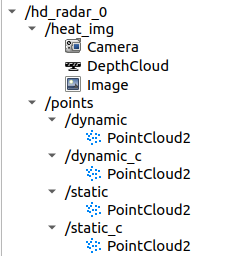
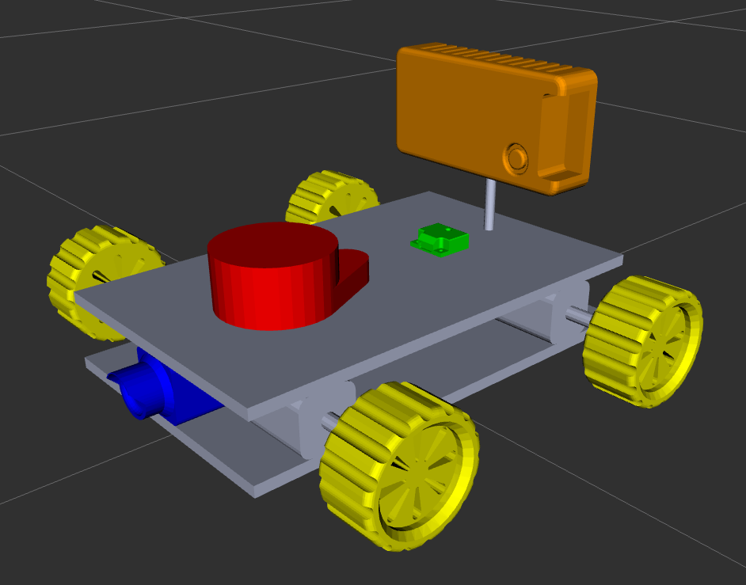
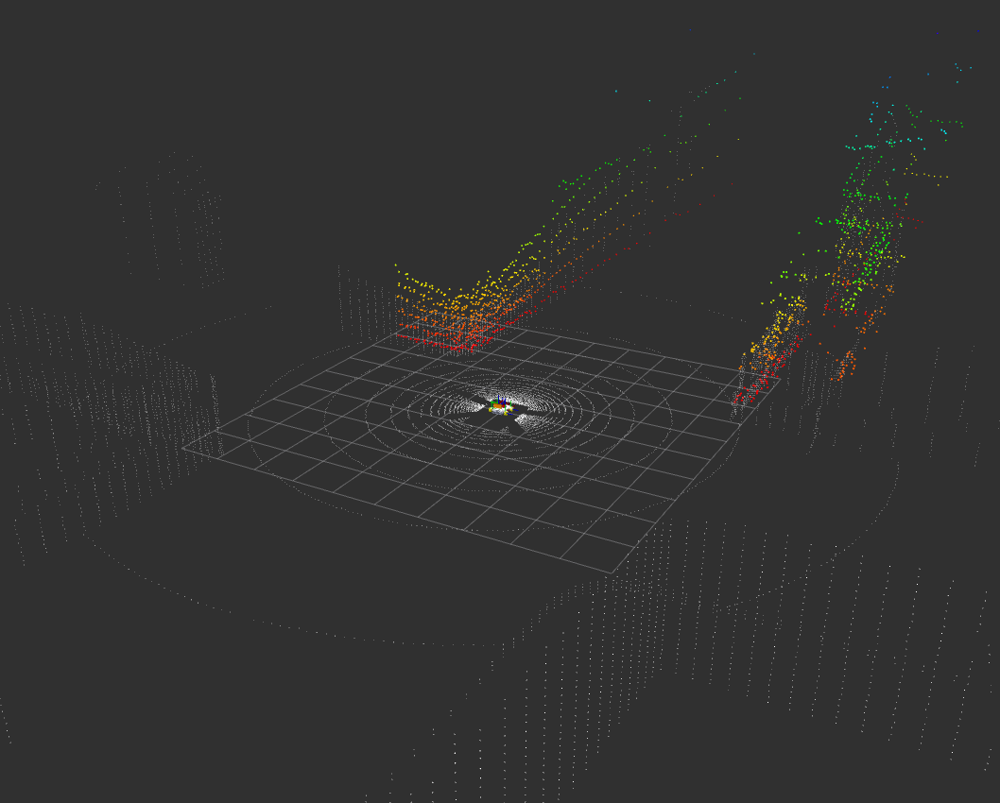

# ROS2 Радар

Рассматривался радар от компании INTEGRANT:  
https://integrant.ru/hdradar  

## ЧАСТЬ 1. Предварительный анализ

Как указано на сайте, радар имеет 4 режима работы:  

| Параметр                          | Режим LRR | Режим MRR | Режим SRR | Режим USRR |
|-----------------------------------|----------|----------|----------|-----------|
| Максимальная дальность, м         | 150      | 100      | 50       | 25        |
| Диапазон измеряемых скоростей, км/ч | -400..+200 | -400..+200 | -200..+100 | -100..+50 |
| Разрешение по дальности, м        | 0,6      | 0,4      | 0,2      | 0,1       |
| Разрешение по скорости, км/ч      | 0,3      | 0,3      | 0,15     | 0,1       |
| Сектор обзора по азимуту, °       | 10       | 20       | 90       | 120       |
| Разрешение по азимуту, °          | 2        | 2        | 2        | 2         |
| Сектор обзора в вертикальной плоскости, ° | 20 | 20 | 20 | 20 |

\* Для объекта с ЭПР 10 м² 

Так же на сайте производителя выложен ROS2 драйвер к радару.

```
colcon build --packages-select hd_radar_interfaces
colcon build --packages-select hd_radar_driver
source install/setup.bash
ros2 launch hd_radar_driver hd_radar.launch.py
```

После запуска можно посмотреть, в какие топики радар публикует сообщения `ros2 topic list`:  

```
/hd_radar_0/heat
/hd_radar_0/heat_img
/hd_radar_0/points/dynamic
/hd_radar_0/points/dynamic_c
/hd_radar_0/points/static
/hd_radar_0/points/static_c
/hd_radar_0/raw
```

В RViz можно посмотреть в каком формате ROS2 публикуются сообщения:



Радар умеет различать динамические и статические объекты. Он публикует облака точек и карту дальность-скорость.

## ЧАСТЬ 2. Симуляция в Gazebo

Использовалась модель робота из дургого репозитория:  
https://github.com/DmitryRastiK/my_robot_project

Была убрана камера глубины, на ее место поставлена модель радара. Сама модель радара была сделана на основе фотографий на сайте производителя. 



🟡 Поскольку плагинов для работы с радаром в Gazebo нет, то радар был реализован на основе 3D лидарного датчика. 

Симуляция происходит в созданном мире, содержащем пересечение улиц с домиками.

Изменяя параметры радара (см. таблицу выше) были симулированы все 4 режима работы:

1. Режим LRR (Large Range Radius)
2. Режим MRR (Medium Range Radius)
3. Режим SRR (Small Range Radius)
4. Режим USRR (Ultra Small Range Radius)

